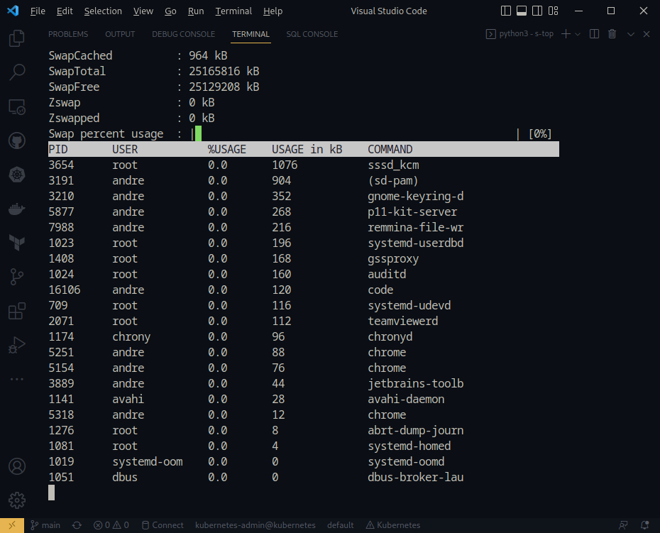

## s-top
 A simple tool to view Swap usage on Linux hosts

## How to use
```bash
$ git clone https://github.com/ambrisolla/s-top.git
$ cd s-top
$ ./s-top.py
```

## Screenshot


## License
Apache License, Version 2.0, January 2004
